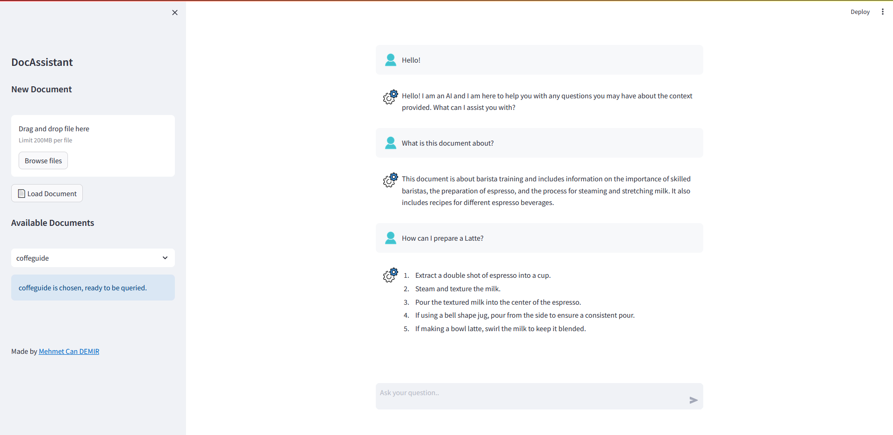
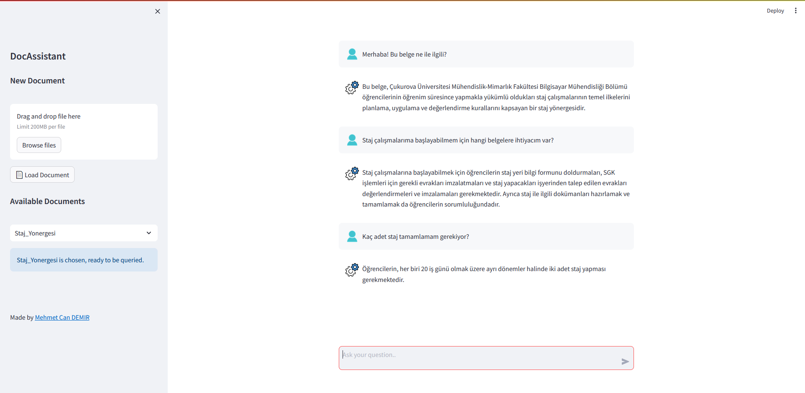
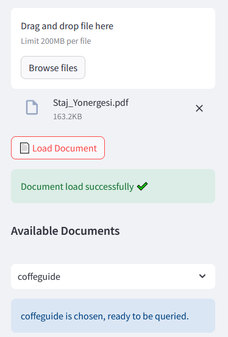
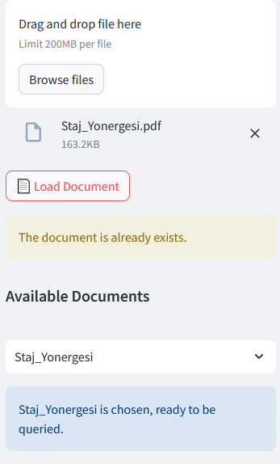

# DocAssistant

🛠️ A document-querier Artificial Intelligence application powered by cutting-edge LLMs. It uses LangChain in the backend as the LLM integration framework in order to parse and vectorize the upmost desired documents.

🛠️ Uses unique notifiers to keep the human interaction active and maximize the usability.

